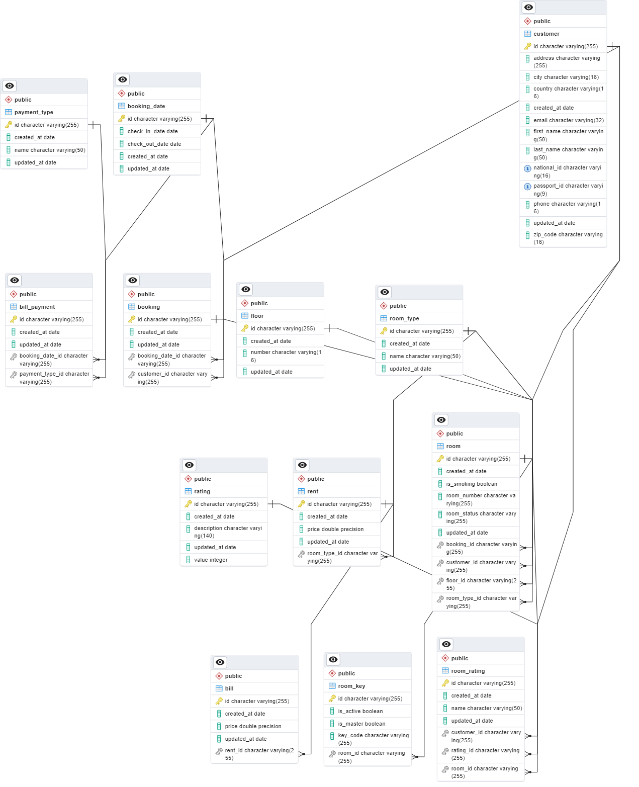

# Hotel Room Booking System

## Description

This is a simple hotel room booking system.

## Getting Started

### Prerequisites

* Java 17
* Maven
* Docker
* Postgres

### Installing

* Clone the repository
* Open the project in your favorite IDE
* Run `mvn clean install` to build the project
* Create a database named `HotelBookingSystem` in Postgres

## Requirements

* Each Customer can request for one or more Room.
* Each Room can be requested by one Customer
* Each Admin can assign one or many Room.
* Each Room must be assigned by one Admin.
* Each Room must be belongs to one Room Type.
* Each Room Type can contain one or many Room.
* Each Booking must be belongs to one Date.
* Each Date can contain one or more Booking.
* Each Room Type can contain one or many Rent.
* Each Rent must belongs to one Room Type.
* Each Booking must include one or many Room.
* Each Room can be included in one Booking.
* Each Customer can hold one or many Booking.
* Each Booking must belongs to one Customer.
* Each Rent can be included in one or many Bill.
* Each Bill must include one Rent.
* Each Bill Payment must include one Payment Type.
* Each Payment Type can contain one or many Bill Payment.
* Each Date can contain one or many Bill Payment.
* Each Bill Payment must belongs to one Date.
* Each Room can be rated one or many Room Rating.
* Each Room Rating must belongs to one Room.
* Each Rating can contain one or many Room Rating.
* Each Room Rating must belongs to one Rating.

## Entity Classes

### Customer

- customer_id Integer
- first_name String
- last_name String
- national_id String
- passport_id String
- email String
- phone String
- address String
- city String
- country String
- zip_code String
- created_at Date
- updated_at Date
- room List<Room> (One to Many)
- booking List<Booking> (One to Many)
- roomRating List<RoomRating> (One to Many)

### Room

- room_id Integer
- room_number String
- room_type RoomType (Many to One)
- room_status RoomStatus (Enum)
- is_smoking Boolean
- created_at Date
- updated_at Date
- rent List<Rent> (One to Many)
- booking Booking (Many to One)
- room_rating List<RoomRating> (One to Many)
- floor Floor (Many to One)
- roomKey List<RoomKey> (One to Many)

### RoomType

- room_type_id Integer
- room_type_name String
- created_at Date
- updated_at Date
- room List<Room> (One to Many)
- rent List<Rent> (One to Many)

### RoomStatus

- AVAILABLE
- RESERVED
- OCCUPIED
- MAINTENANCE

### Floor

- floor_id Integer
- floor_number Integer
- created_at Date
- updated_at Date
- room List<Room> (One to Many)

### RoomKey

- room_key_id Integer
- room_key_barcode String
- is_active Boolean
- is_Master Boolean
- created_at Date
- updated_at Date
- room Room (Many to One)

### Booking

- booking_id Integer
- created_at Date
- updated_at Date
- customer Customer (Many to One)
- booking_date BookingDate (Many to One)
- room List<Room> (Many to One)

### BookingDate

- booking_date_id Integer
- check_in Date
- check_out Date
- created_at Date
- updated_at Date
- booking List<Booking> (One to Many)
- bill_payment List<BillPayment> (One to Many)

### Rent

- rent_id Integer
- rent_price Double
- created_at Date
- updated_at Date
- RoomType RoomType (Many to One)
- bill List<Bill> (One to Many)

### Bill

- bill_id Integer
- bill_price Double
- created_at Date
- updated_at Date
- rent Rent (Many to One)

### BillPayment

- bill_payment_id Integer
- created_at Date
- updated_at Date
- payment_type PaymentType (Many to One)
- booking_date BookingDate (Many to One)

### PaymentType

- payment_type_id Integer
- payment_type_name String
- created_at Date
- updated_at Date
- bill_payment List<BillPayment> (One to Many)

### RoomRating

- room_rating_id Integer
- rating_name String
- created_at Date
- updated_at Date
- room Room (Many to One)
- rating Rating (Many to One)
- customer Customer (Many to One)

### Rating

- rating_id Integer
- rating_value Integer
- rating_description String
- created_at Date
- updated_at Date
- room_rating List<RoomRating> (One to Many)
